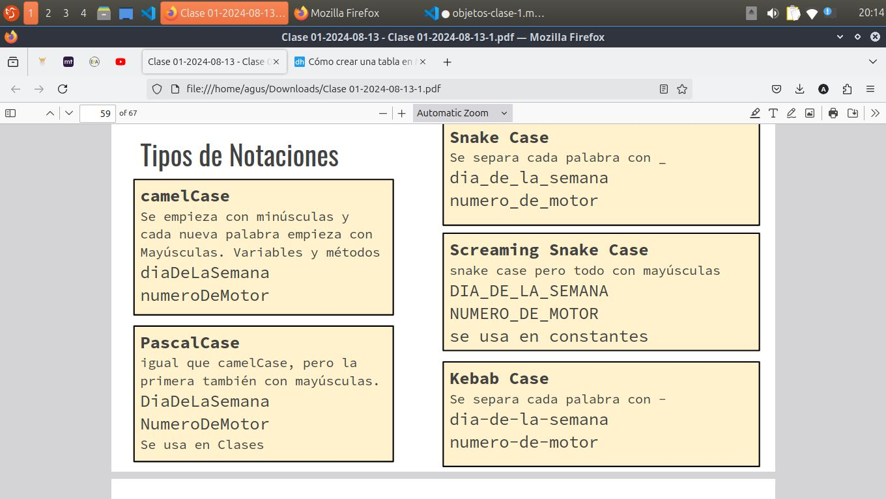

## ¿Por qué objetos?
Es un nuevo enfoque que significó una revolucin industrial, permite la reutilización de software.

Se busca increetar la productivida, la calidad, la compresion y el tiempo útil del software.

Una aplicación orientada a objetos es un conjunto de estos interactuando mediante mensajes para cumplir determinados objetivos.

### Orientacion a Objetos

- Énfasis en las *abstracciones* de los datos.
- Las **funciones** y los *datos* son *ecapsulados* en entidades *fuertemente relacionadas*.
- Facilita el mantenimiento por *especialización*.
- Correlacón directa con las entidades del dominio.

### Brecha semantica

Reduce la brecha de representación entre el modelo de software y el dominio que se representa. 

## Definiciones

### ¿qué es un objeto?

Es un componente de software almacenado en memoria, encapsula datos y comportamientos en una unidad.

### Objetos: Conceptos Reales

**En un sistema de contról d   e tráfico aéreo**:

- aviones
- pistas
-torres de control
- etc

**En un sistema de alumnos de  una facultad**:
- Alumnos
- Curso
- Docente
- etc

### Entidades abstractas

- Una formula matematica

- un evento (un click)

### Vista dinámica de los objetos

- Los objetos se crean y se destruyen en forma *dinámica*
- Tienen su propia identidad y encapsulan estado y comportamiento
- Las *variables de instancia* mantienen referencias a otros objetos
- El comportamiento de los objetos es definido por los *métodos*

### Los objetos

Revelan qué pueden hacer y qué información pueden proporcionar, pero no revelan  cómo lo hace o como lo conoce

(esto es encapsulamiento)

### Encapsulamiento:
Se refiere al ocultamiento de *informacion o detalles*

Los datos en los objetos son privados, desde fuera de el no se puden acceder ni modificar.

A su vez los métodos son tipicamente públicos. Desde fuera del objeto se le puede enviar un mensaje para que invoque a los métodos.

## Responsabilidad y colaboracion

Los objetos tienen responsabilidades. Por ejemplo, un avión  es responsable por conocer su hora de aterrizaje. 

Los objetos pueden colaborar entre sí para cumplir con sus responsabilidades. En este caso un avión colaboraría con una torre de control para calcular su hora de aterrizaje. 

Esta colaboración se dá a través del envío de mensajes. 

## Mensajes y métodos

- Todo el computo es realizado por los objetos. 
- La unica forma de interactuar con un objeto es enviandole un mensaje. 

**Mensaje**: Señal que se le envía a un objeto para invocar a uno de sus métodos. 

**Método**: Comportamiento de un objeto que se ejecuta cuando este recibe un mensaje.

En un sistema de control aereo, como sería un vuelo? Qué dato y responsabilidades tiene?

se me ocurre: avios, piloto, pasajeros, destino, origen, etc 

## clase vs instancia

Generalmente vamos a necesitar muchos objetos de un mismo tipo en un programa (un tipo es el objeto en sí,  es decir, Avion es un tipo, todos los objeto Avion son de ese tipo)

Clase: Es el "molde" para crear objetos con un determinado comportamiento y estado, define a las instancias. Es una "fábrica" que crea objetos de un determinado tipo. 

Instancia: Es creda por una clase. Ocupa espacio en memoria. Mantiene un estado, posee comportamiento y conoce a que clase pertenece (tipo). 

Ejemplo:

**clase** -> Persona
Generalmente son escritas en singular, ya que modelan a un sólo objeto por vez, no a una lista.

**Objetos** -> Juan, Pedro, Carlos.
Los objetos son las variables y son los que tienen los valores de una clase

## Java y POO

Java es un lenguaje de programacion oriantado a objetos. Nos brinda cierta flexibilidad que a veces puede ser poco orientada a objetos, por lo que no garantza que tengamos una solucion correctamente orientada a objetos. 

### POO

Es la forma de programar. No garantiza el exito de la aplicacion si está está orientada a objetos, pero no cumple con los rewquerimientos del cliente. 

### Lenguaje y plataforma Java

Java es el nomrbe tanto del lenguaje como de la *plataforma de desarrollo*. Estan pensadas para desarrollar aplicaciones *multiplataforma*.

### Plataforma Java

Es un conjunto de herramientas de software.     

### Bytecode

Es el lenguaje intermedio de la plataforma java. 

|ejemplo.java|javac.exe|ejemplo.class|
|------------|---------|-------------|
|
Codigo fuente en lenguaje java(es unarchivo de exto legible)| compilador Java| Codigo en for mato Bytecode (no es un texto facilmente legible)|


En la plataforma java existe un programa llamado máquina virtual o *vm* que traduce Bytecode al código de la máquina actual

*Bytecode* es un lenguaje similar al código de máquina, pero no depende del tipo del CPU

Tambien se encarga del manejo de la memoria ram, por lo que esto se supone automatico. La parte de la vm que se encarga de esto es el garbage collector. 


### Clase en Java:

```java
    public class Avion {

    }
```

> Esto se guarda en un archivo Avion.java

Ahora que tenemos la clase, debemos crear la instancia

```java
    Avion air314 = new Avion();
```

### Atributos:

- Primero, tenemos que establecer que cosas va a tener nuestro avión: Capacidad, un nombre, color, modelo, motor, kilometraje, etc.

- No tiene sentido poner un atributo que pertenecen a otras entidades, como "precio" o "número de ticket de recital".

> Esto se suele denominar *alta cohesion* (los atributos del avion tienen relaicion con la entidad avion)

```java
    public class Avion{
        int capacidad;
        String estado;
        String color;
        Fabrica marca;
    }
```

### Métodos:

*tipo_retorno* nombreMetodo(*tipo_arg1 arg1*){
    return retorno;
}

*void* nombreMetodo(*tipo_arg1* arg1){

}

> Normalmente tanto atributos como métodos siguen la convencion camelCase



### Clase avion métodos 

Supongo que queremos cambiar el color del avion o preguntarle su color

```java
public class Avion {
.... // los atributos anteriores
    public void setColor(String unColor){
        color = unColor;
    }
    public String getColor () {
        return color;
    }
}
```

```java
/*Clase Vuelo- Métodos
Supongamos que queremos saber a pista en la que aterriza el
vuelo*/
public int getPistaAterrizaje() {
    return (destino.getTorreControl()).getPista(avionQueVuela);
    // ( TorreControl ) .getPista(AVION)
    // (PISTA)
}
```
### Contructor de un objeto

El constructor puede verse  como el método invocado para la construccion de un objeto. Cuando hacemos:

    Avion air314 = new Avion();

Invocamos al *constructor sin argumentos* de la clase avion. El constructor es quien se encarga de crear al objeto y setear los valores iniciales del mismo

```java
public class Avion {

int capacidad;
String estado;
String color;

public Avion(){ // CONSTRUCTOR SIN ARGUMENTOS
    capacidad = 100; //VALORES POR DEFECTO
    estado = “en Tierra”;
    color = “blanco”;
}

public Avion (int cap, String col){//DOS PARAMETROS
    capacidad = cap;
    color = col;
    estado = “en Tierra”; //DEFECTO
}
```

> Un objeto puede tener múltiples constructores todos ellos deben tener una ***signatura*** diferente. Cuando se llama a un constructor es cuando se decide cual se invoca.

>Avion a234 = new Avion(); //100, blanco

>Avion a235 = new Avion(25, “Rojo”);