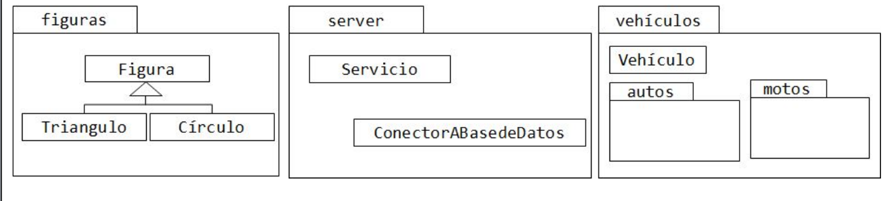
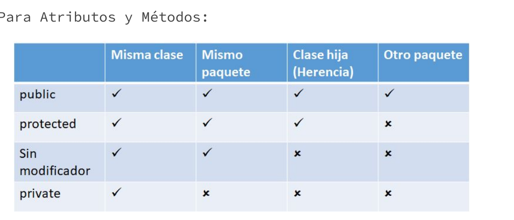
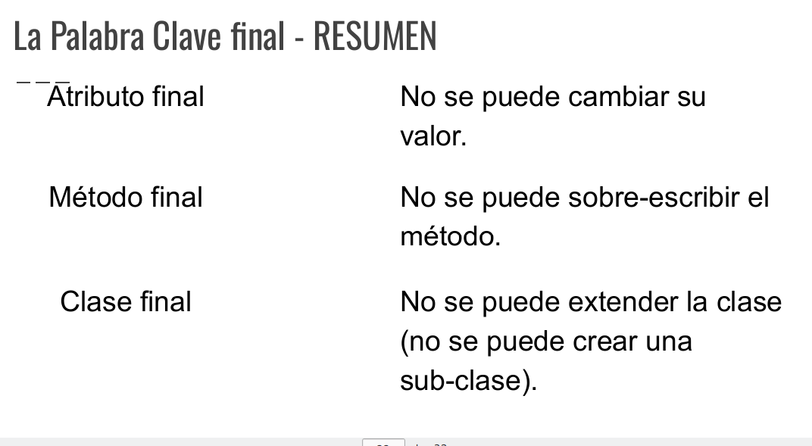

## Conceptos

## This

Es una palabra clave, se refiere al objeto actual.

[medio circulo [ Circulo [ figura ] ]  ] 

Figura -> Circulo -> MedioCirculo.
Este es el orden de herencia.

Si creamos un objeto `MedioCirculo` y le eviamos un mensaje que ejecuta un método, el cuál utiliza un *this* y a su vez este método estña en `Figura`, como puede ser `this.getNombre()`. El *mensaje se envia al objeto actual*, es decir, a la instncia de MedioCirculo.

Tiene varias utilidades:

- Poder manipular el objeto actual (por ejemplo pasarlo como parametro)
    - `Sytem.out.println(this)`
- Diferenciar entre variables/parámetros y atributos locales.
    - this.nombre = nombre;//nombre es el var local del método y this.nombre hace referencia al atributo de la clase.
- Reutilizar constructores existentes
    - 
    ```java
    public Persona (String nombre, int dni){
        this(dni);//implica un contructos Persona(int dni)
        thiis.nombre = nombre;
    }
    ```

## Paquetes en java:
Proveen una forma de organizar el código fuente de nuestra app, también define un espacio de nombres para nuestras clases



- Se escriben en minuscla
- Para acceder a cada nivel se utiliza el "."
    - Por ejemplo "vehiculos.autos.Camioneta"

- Se mapean directamente a carpetas del sistema de archivos

### Declaracion de paquetes:
```java
package tp3.ejercicio1;

Public class Persona{
    ...
}
```


La clase persona pertenece al paquete tp3

### Importar paquetes:
```java
package tp3.ejercicio1;
//Se colovan los imports uno debajos del otro y luego de la declaracion del paquete
import java.util.Vector;//Importar una clase de la plataforma Java
import tp3.ejercicio2.Electrodomestico;
import java.io.*; // Importamos todas las clases del Paquete

public class Persona{
    
}

```


## Modificadores de Acceso:

Estos modificadores pueden usarse en atributos o métodos.

- `protected int edad;`
- `private void ordenarSecuencia(){...}`

Definir atributos públicos hace que se rompa el encapsulamiento de los objetos.



## Super
Permite referirnos explicitamente  a los métodos y atributos que son parte de la clase superior

Continuando con el ejemplo del MedioCirculo

```java
public double getArea(){
    return super.getArea()/2;
    /*El area de mediocirculo es la mitad del area del circulo, de quien heredamos. Estamos REUSANDO el comportamiento*/
}
```

De forma similar a this, se utilza para:

- Utilizar de forma explícita **métodos** y **atributos** de la clase superior (en particular, es útil cuando deseamos invocar un método de la clase padre desde un método sobreescrito)

- Utilizar constructores de la clase superior (muchas veces obligatorio)

```java
public Alumno (int dni, int legajo){
    super(dni);//definimos el atributo dni usando el constructor de nuestro padre, que debemos invocarlo
    this.legajo = legajo;
}

```

A veces, se es necesario distinguir entre llamadas a atributos o métodos de la clase superioir. En otros casos es obligatorio para evitaro errores de código.

En general se desaconseja utilizar atributos de forma directa mediante super.

## Atributos y métodos de clase


### Atributo:
Un **único valor** para un atributo de una clase (es el mismo para todos los objetos creados, cero o más)

Por ejemplo, un contador de personas creadas:


> `static int contador` <br>

La palabra *static* nos indica que es un atributo de clase.
Para los objetos es una tributos más, la diferencia es que es la MISMA variable para todos los objetos, si un objeto cambia el valor de esta, se cambia para todos los objetos.

```java
    static int contador = 0;// se inicializa el contador para todos
    contador++;// aumenta en uno el contador para todos
```

Son variables *asociadas con la clase* y **no** con instancias particulares. Para acceder a un atributo de clase <u>NO</u> es necesario crear instancias de la clase. Pueden ser accedidas usando el nombre de la clase y sin haber creado instancias.

Son Globales Para la clase.

### Métodos de clase:

Al igual que los atributos de clase *static*, estos métodos *no se encuentran asociados a instancias* u objetos.

Este método  pued ser invocado incluso cuando no existen objetos. Como por ejemplo:

`Math.random()`: es un método de la clase Math, no es necesario crear un objeto para invocarlo.

Como definirlo:
```java
public static int getContador(){
    return contador;
}
```

Se puede ser accedido usando `Persona.getContador();`

<u>**NO**</u> se pueden invocar métodos no *static* dentro de un método static. (ya que no existen instancias)

Si es posible invocar un método estático ***dentro*** de la misma clase que lo define, sin ningún objeto.

### Tener cuidado con:

- Las variables locales **NO** pueden ser static

- Solo los ***atributos*** pueden ser static

- Si el atributo static es de tipo primitivo y no es inicializado, toma el valor standard inicial para su tipo.

```java
 int = 0;
 float, double = 0;
 boolean = false;
```

Si el atributo static es la referncia a un objeto, toma el valor **null**.

## final

- Esta palabra clave se utiliza para definir "constantes". En un atributo es un valor que nunca cambia. 
- En una clase es una clase que *no puede ser extendida*
- En método es un método que no puede ser redefinido (la clase que extiede no puede declararlo nuevamente).

```java
    final int MAYOREDAD=23;
    /*Define en la clase persona una constante para la mayoria de edad, por converncion van con mayusculas*/
```

No tiene sentido una constante por instancia, por eso se usa **static**. Si queremos que todo el mundo la conozco usamos el modificador **public**. 

```java
   public final int MAYOREDAD=23;
```

En este caso, podemos accedera a la constante -> `Persona.MAYOREDAD`

### clase
Una clase final no puede ser extendida
```java
    public final class Persona {....}

```
```java
    public class Alumno extends Persona {....}//DA ERROR

```

### método

Este no se puede sobreescribir:

//En figura<br>
`public final String getNombre(){}`

Nadie puede cambiarlo:
//En circulo<br>
`pulic String getNombre(){...}`//Da error


