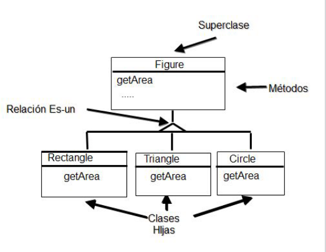
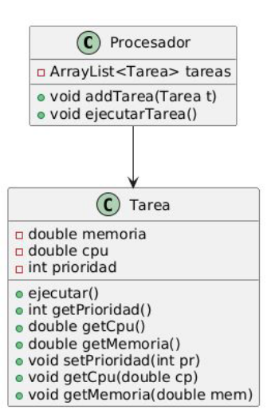
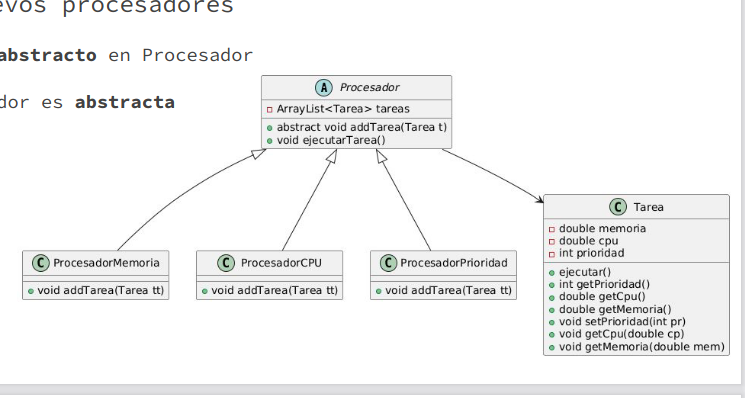
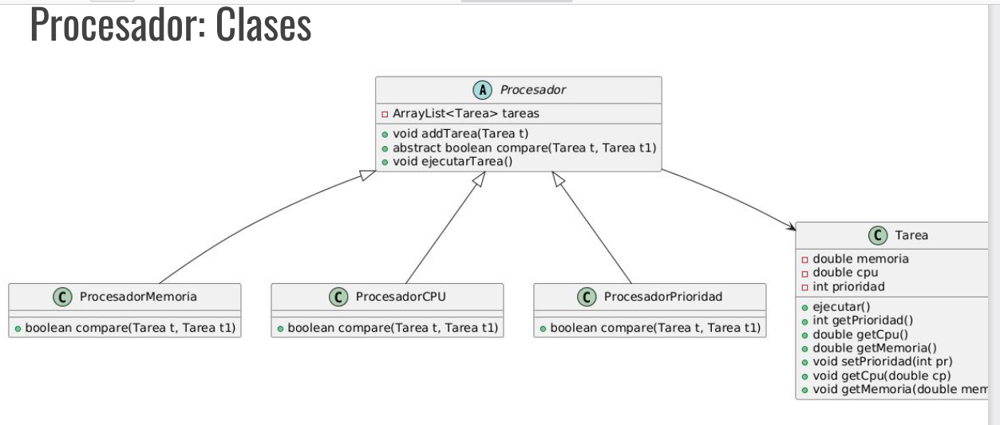
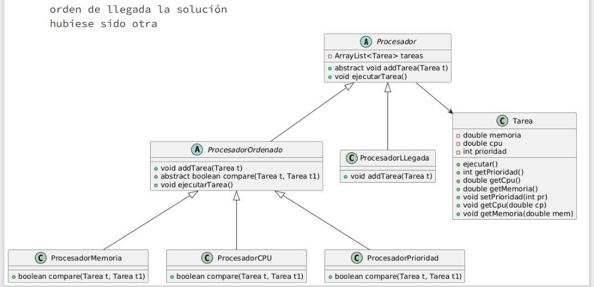

Normalmente con *abstraccion* nos referimos a algo enfoncandonos en el aspecto que nos interesa (ese "rasgo general") y no en detalles innecesarios. 

Por ejemplo, el concepto de mueble, si digo "para mudarme tengo que llevarme los muebles", con "mueble" sabemos que nos referimos a las sillas, mezas, muebles, camas , etc. Una idea de algo, sin ser muy especifico.

En la programacion Orientada a Objetos se pueden definir clases que representan un concepto abstato. El concepto de figura geometrica es una clase Abstracta. Estas "*clases coneptuales*" *<u>no pueden ser instanciadas</u>*. 



### Clase Abstracta

Una clase abstracta no puede tener instancias, porque en ese caso, en el ejemplo de Figura , porque no podemos obtener su area ni su perimetro. El concepto de Figura abstrae comportamiento común y caracteristicas que deben tener las figuras. En cambio, un *círculo* si es un elemento concreto al cual le podemos pedir tanto área como perimetro.

Este tipo de clases, si bien no se las puede instanciar, si se las puede extender.

Las declaramos de la siguiente manera:

```Java
    public abstract class Figura{...}
```

> Intentar instanciar una clase abstracta genera un error de compilación.

### Método abstracto:
Una clase abstracta además de poder contener métodos (**concretos**) y atributos, *también pueden contener **métodos abstractos***.

Un método abstracto *define comportamiento común* de todos los objetos *de las subclases* concretas de la clase abstracta (es decir, las clses concretas que la hereden).

```java
    public abstract double getArea();
```

> Si una clase posee un método abstracto, **la clase es abstracta** por lo que debe declararse como tal.

### Clases herederas

Una clase que *hereda de una clase abstracta* debe heredar **todos** los métodos de la clase de la que hereda, si no puede implmentar todos, entonces también debe declararse abstracta.

`public class Circulo extends  Figura {...}`

```java
public abstract class FigAreaFija extends Figura{
    double areaFija;
    public double getArea(){//implmentamos getArea que era abstracto
        return this.areaFija;
    }
    //como no pomdeos implmentar getPerimetro, ya que sólo contamos con el area, por lo que nos faltan datos, debemos declaranos como abstracto

}
```
```java
    public class FiguraFija extends FigAreaFija{
        /*Sólo debe implmentar un método abstracto getPerimetro, ya que el otro ya está implmentado por FigAreaFija*/
        double perimetro;
        public double getPerimtro(){
            return this.perimetroM
        }
    }
    /*Ahora sólo debemos instanciar esta clase, y vamos a tener acceso a los dos métodos, getArea y getPerimetro*/
```

Conceptualmente en POO **NO** deben existir clases abstractas que no contengan *al menos un método abstracto*. Esto se aclara porque Java permite clases abstractas sin métodos abstractos (como tambien permite definir atributos publicos).

## Ejemplo Procesadores

A un procesador se le asignan tareas, las cuales poseen una prioridad, uso de memoria y uso de CPU. El procesador X ordena las tareas de acuerdo a la prioridad de las mismas, mientras que otros procesadores las ordenan por uso de CPU o de Memoria.

### Procesadores



Esto sería una primera aproximación a la solución.

```java
public class Procesador{
    ArrayList<Tarea> tareas;
    public Procesador(){
        tareas = new ArrayList<>();
    }

    public void ejecutarTarea(){
        if(tareas.size()>0){
            Tarea tareaActual = tareas.get(0);
            tareas.remove(0);
            tareaActual.ejecutar();
        }
    }

    public void addTarea(Tarea nuevaTarea){
        int i = 0;
        while(i < tareas.size()  && (nuevaTarea.getPrioridad() > tareas.get(i).getPriodidad())){
            i++;
        }

        tareas.add(nuevaTarea, i);
    //En este caso, sólo ordena por prioridad
    }

}
```

¿Cómo permitimos que se ordene por uso de memoria y por uso de CPU?

Primero, incoporamos nuevos porcesadores, uno por cada tipo:



La idea, sería definir a  ***Procesador*** como una clase abstraca, con el método abstraco `addTarea()`.

```java
//ProcesadorMemoria

/*Sobreescribimos el método addTarea*/
public void addTarea(Tarea nuevaTarea){

    int i = 0;
    while ( i < tareas.size() && (tarea.getMemoria() < tareas.get(i).getMemoria())) {
            i++;
    }
    if(i < tareas.size()){
        tareas.add(nuevaTarea, i);
    }else{
        //básicamente, sería la tarea con menos consumo
        tareas.add(nuevaTarea)
    }
}
```

```java
    //Procesador CPU

    /*Sobreescribimos el método addTarea*/
public void addTarea(Tarea nuevaTarea){

    int i = 0;
    while ( i < tareas.size() && (tarea.getCPU() < tareas.get(i).getCPU())) {
            i++;
    }
    if(i < tareas.size()){
        tareas.add(nuevaTarea, i);
    }else{
        //básicamente, sería la tarea con menos consumo
        tareas.add(nuevaTarea)
    }
}

```


El método para agregar tareas es igual para los 3 casos, sólo cambia la condición para hacerlo.

### Abstraccion del método add:
<u>En la clase Procesador</u>:

```java
    public void addTarea(Tarea nuevaTarea){
        int i = 0;
        while(i < tareas.size() && (this.compare(nuevaTarea, tarea.get(i)))){
            i++;
        }

        if(i < tareas.size()){
            tareas.add(nuevaTarea, i);
        }else{
            tareas.add(nuevaTarea);
        }
    }


    public abstract boolean compare(Tarea  t1, Tarea t2);
    /*El método anterioir es el encargador de comparar las tareas, tanto la que queremos agregar como las iteradas,
    * acá estamos "obligando" a quienes hereden de nosotros a que implementen este método. 
    */
```


Todas las clases ahora deben implementar el método abstracto compare:

- Cpu:

```java
    public boolean compare(Tarea t1, Tarea t2){
        return t1.getCpu()< t2.getCpu();
    }
```
....

Y ahora por ejemplo, si nos pidiesen que implementaramos un Procesador que ordena por orden de llegada, es decír que siempre lo agrega al final, no necesitamos este método addTarea como está implementado en la clase Procesador abstracta, pero igualmente debemo heredar de ella, lo que incluye también ambos métodos abstracto, tanto el template como el compare. Aunque no lo necesitemos, debemos implementar el compare para que  no nos obligue a declararnos abstractos. Y por último sobreescribir el método `addTask()`. 

Pero si nosotros lo hubiesemos conocido desde el principio, o si decidimos hacer un refactor, podriamos hacer hecho lo siguiente:

Tener una clase abstracta `Procesador` con un método abstracto también `public void addTask(Tarea nuevaTarea);`. Luego impementar dos clases que hereden de el. La primera es la clase `ProcesadorOrdenado` que también es abstracta. Define dos métodos abstractos, el `addTask` template, y el `compare` que definiran/implementaran sus hijos. Y el `ProcesadorLlegada` que seria el último que agregamos, y sólo definimos el comportamiento del `addTask()` de `Procesador`.


