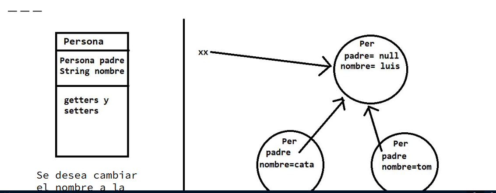

El procesador hasta ahora estaba haciendo cosas propias de un Procesador, como ordenar y ejecutar tareas, y a su vez estaba o debía ejecutar cosas propias de la eestructura donde se almacenan las tareas, tales como ordenar una vez se cambia el parametro de ordenado y demás. Por eso en esta clase, ya no usamos un arralist como una pila, sinó que ahora creamos nuestra propia estructura, buscando que sea una cola de tareas o queue.

Cuando tenemos que cambiar algo en tiempo de ejecucion, es importante no crear un nuevo objeto. En este caso, cambiamos el comportamiento, es decir, la forma de ordenar de la cola de tareas, con un parametro comportamiento. Internamente si se crean nuevo objetos y demás pero que no terminan de afectar a procesador. 

Practico 6 abstraer. Es importante razonar cuando debemos abstraer el comportamiento y demás. Como en el primer ejemplo con Procesador o ahora con ColaTarea.

## Teorico:

Cambio en tiempo de ejecucion:

- Hacer que algo sea "Dinamico"
- Se puede cambiar algo sin tener que crear un objeto nuevo
- Por ejemplo valores de atributos

### Ejemplo en el nombre de una persona

En este ejemplo, lo que queremos cambiar es el nombre del elemento "padre" referenciado por "`xx`". Esto obviamente lo hacemos de manera dinamica, no creamos un nuevo obeto llamado de otro nombre para referenciarlo por xx. Pero si lo hicieramos los demás objetos, que referencian a nuestro objeto original no se enteran del cambio, es decir, ellos ahora no apuntan a nuestro nuevo objeto como su Padre.

Normalmente para realizar este cambio vamos a usar un `.setNombre()`, por lo que deberiamos proveer dicho método. En este caso, los demás objetos *se enteraron del cambio*. Por lo tanto, si a cata se le pide el nombre del padre esta sabe que seria el que seteamos.

### Atributo vs. Comportamiento

- Para cambiar el valor de un atributo no pensamos no pensamos en crear un nuevo objeto, sinó usar el set.
- ¿Qué pasa cuando pensamos en cambiar el comportamiento de un objeto? Es decír que si antes ordenabamos algo por prioridad ahora queremos que sea por memoria.
  
### Procesadores:

Como cambiamos la forma de ordenar de un procesador en tiempo de ejecucion? ¿Qué sucede con la herencia?

Siguiendo el ejemplo de Persona y nombre, si creamos un nuevo Procesador, los demás objetos que apuntan a este, como pueden ser computadora y administrador no se enteran del cambio.

- Ahora, ¿qué queremos cambiar?
- ¿Para poder cambiarlo y que esto impacte en los demás objetos qué particularidad debe tener?
  
En el ejemplo de Procesador vamos a querer cambiar en tiempo dinamico el comportamiento del ordenado. Es decír, abstraer a la clase de la forma de almacenamiento de las tareas.

El procesador no tiene por qué involucrarse con Formas de guardar elementos.

En este punto surge la clase abstracta `ColaTareas`, que nos permite separar la funcionalidad del procesador de la del almacenamiento.

Se delega la responsabilidad propia del ordenamiento a la cola Tareas. Si se cambia la cola de Tarea con la que trabaja el procesador se puede cambiar la forma de orden que este utliza, PERO NO SE CREA UN OBJETO PROCESADOR NUEVO.

