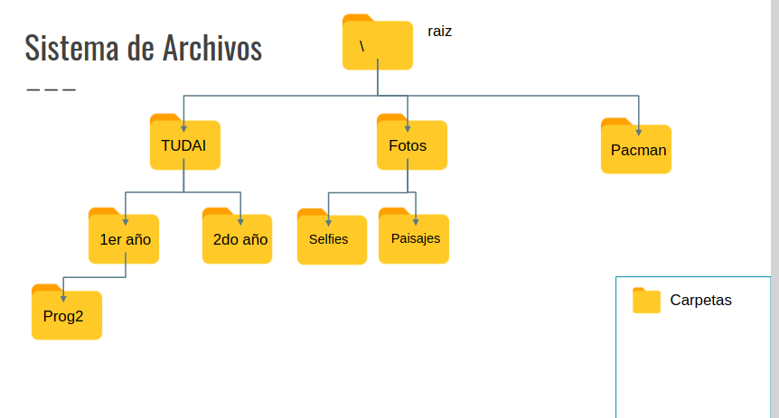
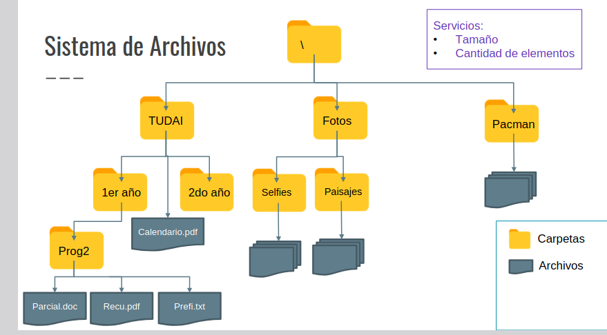
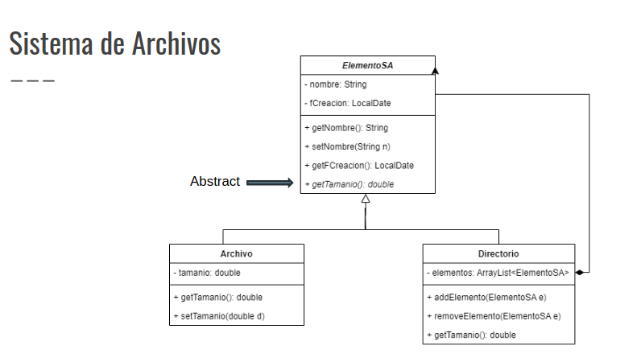
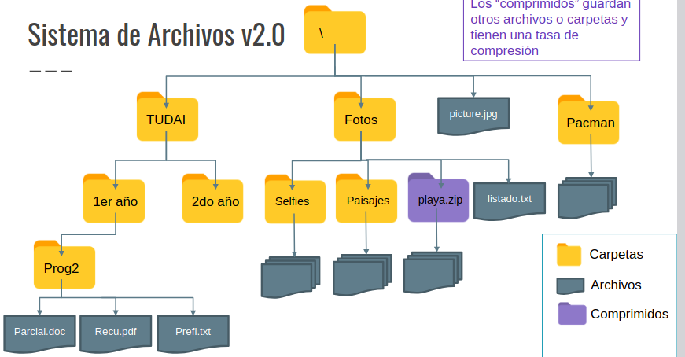
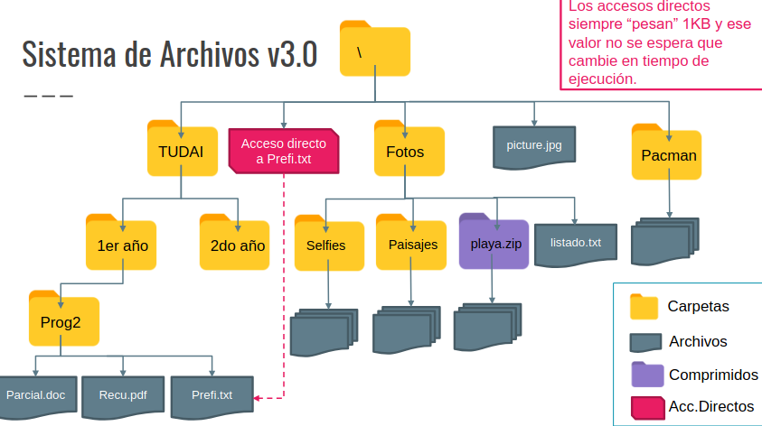
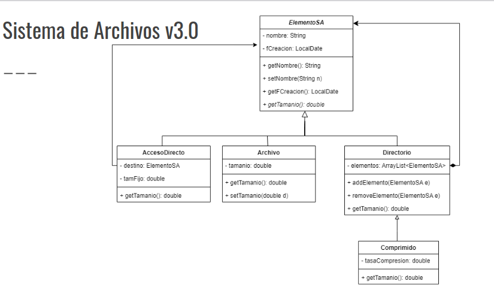

## Problemas a resolver:
Un sistema de archivos debe organizar y manipular los siguientes elementos: **archivos** y **directorios**. Los archivos se definen por un *nombre*, una *fecha* de creacion, y un tamaño. Los directorios tienen un *nombre*, una *fecha* de creacion y un ademas un conjunto de *archivos* y un *subconjunto de directorios*. El tamaño de un directorio está dado por el tamño de sus sub-directorios y de sus archivos.

Implementar una <u>solución orientada a objetos</u> para este problema que permita determinar:

- La cantidad de elementos que posee un derectorio en particular.
- El tamaño de un directorio en particular.

### Diagrama del sistema de archivos:

## Sistema de archivos, version 2.0

La nueva version de nuestro sistema operativo incorpora un nuevo tipo de elemento llamado *comprimido*. Los archivos comprimidos son un tipo particular de elemento del sistema de archivos que ***contienen otros archivos y/o directorios*** en un formato que ***reduce su tamaño según una tasa de compresión dada***, tienen un nombre y una fecha de creación.

## Sistema de archivos, version 3.0:

## Funciones Adicionales:

### Sistema de archivos

- Implementar la posibilidad de realizar búsquedas de **archivos** en el sistema de archivos con diferentes condiciones:
  - Todos los archivos cuyo nombre contengan la palabra "parcial".
  - Todos los archivos con un peso mayor a 1000kb;
  - Todos los archivos modificados luego del 05-10-2022.
  - Todos los archivos creados antes del 25-12-2019.
  - Combinaciones lógicas de búsquedas simples.

-¿Cómo quedaría implementada la búsqueda si incorporamos una “***Carpeta oculta***”, que es invisible (sus archivos no se incluyen) en los resultados de búsqueda?

## [Clase online](https://www.youtube.com/watch?v=cdWYNmfGiLk&ab_channel=MarceloG.Armentano)

