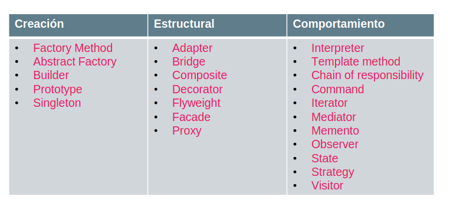
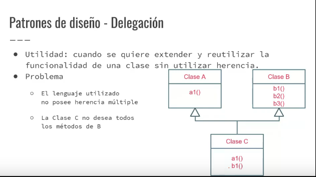
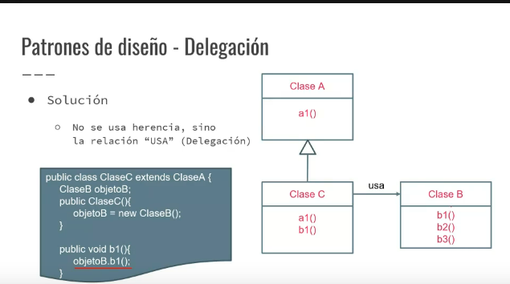
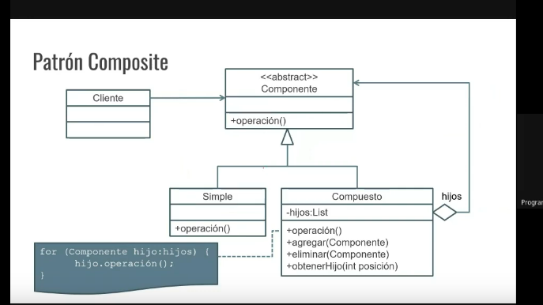
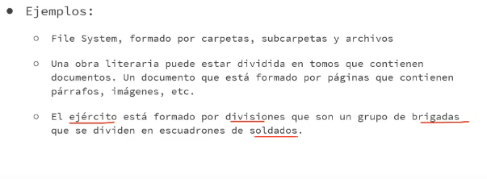

## patrones de diseño

Con observar a nuestro alrededor podemos encontrar conjuntos de elementos que están dispuestos de una determinada manera, siguiendo una regla.

- El diseño orientado a objetos no es una tarea sencilla, y el diseño reusable es aún más dificil.
- Los diseñadores expertos no resuelven todos los problemas desde cero, sino que reutilizan soluciones que han funcionado anteriormente para problemas similares.
  -Buscan  conjuntos de clases, objetos y formas de relacionarlos que son recurrentes en muchos sistemas orientados a objetos.

- En el diseño de software, un patrón de diseño no es más que una forma "*estandarizada*" de resolver problemas comunes.
- Definen un "molde" de una solución para un determinado problema que es un recurrente.
- Resuelven problemas específicos de diseño y hacen que el diseño sea flexible y reúsable.

### Ventajas
- Conforman un amplio catálogo de problemas y soluciones.
- Estandarizan la resolución de determinados problemas
- Condensan y simplifican el aprendizaje de las buenas prácticas
- Proporcionan un vocabulario común entre desarrolladores
- Evitan "reinventar la rueda"

- Elementos de un patrón:
  - **Nombre**: describe el problema de diseño
  - **Problema**: describle cuándo aplicar el patrón
  - **Solución**: describe los elementos que componen el diseño, sus relaciones, responsabilidades y colaboración.

### Calificacion de los patrones según su proposito:
- De creación: Se utilizan para crear y configurar clases y objetos
- De estructura: se utilizan para desacoplar las interfaces e impementar clases y objetos. Crean grupos de objetos con determinadas características.
- De comportamiento: se enfocan en la interacción entre asociaciones de clases y objetos, definiendo cómo se comunican entre sí.

### Patrones de creacion:

- Como su nombre indica, estos patrones vienen a solucionar o facilitar las tareas de creación o instanciación de objetos.
- Estos patrones hacen hincapié en la encapsulación de la lógica de la instanciación, ocultando los detalles concretos de cada objeto y permitiéndonos trabajar con abstracciones.
- Los más habituales son:
  - **Factory Method**: Expone un método de creación delegando en las subclases la impementación.
  - **Abstract factory**: Nos provee una interface que delega la creación de una serie de objetos relacionados sin necesidad de especificar cuáles son las implementaciones concretas.
  - **Builder**: Separa la creación de un objeto complejo de su estructura, de tal forma que el mismo proceso de construcción nos puede servir para crear representaciones diferentes.

- Nos ayudan a definir la forma en la que los objetos se componen. Los más habituales son:
  - **Adapter**: nos ayuda a definir una clase intermedia que sirve para que dos clases diferentes interfaces puedan comunicarse. Tambien se conoce como wrapper.
  - **Decorator**: Permite añadir funcionalidad extra a un objeto (decora al objeto) sin modificar el comportamiento del resto de las instancias.
  - **Facade**: una fachada es un objeto que crea una interfaz simplificada para tratar con otra parte del código más compleja.
  - **Composite**: Permite componer objetos en jerarquias todo-parte y permitir a los clientes tratar objetos simples y compuestos de manera uniforme.

### Patrones de comportamiento:
- Nos ayudan a definir la forma en la que los obejetos interactúan entre ellos.
- Algunos de los más conocidos son:
  - **command**: Son objetos que encapsulan una acción y los parámetros que necesitan para ejecutarse.
  - **Observer**: Los objetos con capaces de suscribirse a una serie de eventos que otro objeto va a emitir, y serán avisados cuando esto ocurra.
  - **Strategy**: Permite la selección del algoritmo que ejecuta cierta acción en tiempo de ejecución.
  - **Template Method**: Especifica el esqueleto del algoritmo, permitiendo a la sub-clase definir como impementan el comportamiento real.

## Clase patrones de diseño

[clase](https://www.youtube.com/watch?v=bsiIcf9f1K0&ab_channel=MarceloG.Armentano)

En el ejemplo de sistema de archivos usamos el patron de Diseño Composite. Este nos dice que si necesitamos algun comportamiento de una clase u objeto, no  debemos heredar sino más bien hacer ese objeto parte de nuestra estrucutra interna, por ejemplo cuando definimos un array list dentro de nuestra clase y luego lo inicializamos.

> Acá pasamos de heredar todos los metodos de la clase B a implementarlos:

### Patron Delegacion:
Ventajas:

- Reemplaza la herencia multiple
- Cuando una clase que hereda de otra quiere ocultar alguno de los metodos heredados
  - > Cuando queremos ocultar un método esto nos indica que probablemente estemos aplicando mal la herencia
- Compartir código que no se puede heredar

### Estructura general de un Composite

En el ejemplo del filesystem, el elemento simple definia la operacion por ejemplo `getTamanio()` simplemente retornando un atributo (por lo que el atributo lo definimos en el elementos simple). Y en el componente definiamos los metodos que ambos elementos debian definir, en este caso el `getTamanio()`, que en el caso del elemento complejo era una lista que llamaba a este método a cada uno de sus elementos, lo sumaba y lo retornaba. Los elementos de esta lista pueden ser **simples** o **complejos**: *Ya que almacenamos **Componente** en vez de un tipo determinado*. 

> El complejo **si o si** tiene una liste de *hijos*.
> Los complejos son los que se deben encargar de manejar la estructura de los hijos, lo que los puede hacer "menos felxibles".
>
- > El componente declara todos los **métodos comunes** entre simples y compuestos
- > El simple son las "hojas" del arbol: no puede contener elementos en su interior y también es quien implementa las operaciones normalmente usando sus propios atributos (`getNombre()`) no hay reestriccion para eso.
- > El compuesto: tiene una lista de hijos e implementa las operaciones definidas en el componente, normalmente utilizando a los hijos y sus métodos (también puede agregar funcionalidad sobre estos) más algo más o no, como cuando queriamos contar la cantidad de archivos, por cada simple sumabamos uno. 

> A veces nos encontramos con enunciados así, pero generalmente se pueden distinguir que por ejemplo ejercito division y brigada suelen ser el componente compuesto, mientras que el simple seria el soldados.