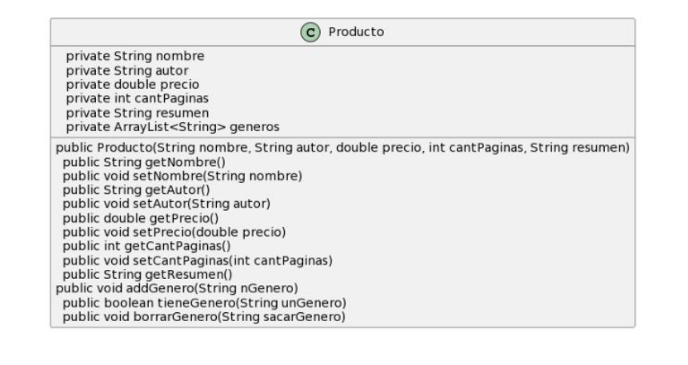

# Ejemplo adicional libreria:

Una  libreria requiere un sistema para sus clientes.

Esta `libreria` vende `libros` y `revistas`. Un libro se compone de un *nombre, autor, precio, cantidad de páginas y géneros literarios que abarca* (pueden ser más de uno). Una revista posee *nombre, autor, cantidad de páginas, precio, resumen, y un listado de géneros*. Del `cliente` guardamos su n*ombre y apellido, dni, direccion, una lista de autores favoritos y una lista de generos que le gustan*. También se guarda el *listado de sus compras* (libros o revistas).

Reconocemos las clases:


Le agregamos sus atributos


Podemos notar que dos clases tienen los mismos atributos

### Primer aproximacción
Revista y Libros quedan vacías porque todos los atributos comunes subieron a una clase "padre", Por lo que ahora no tenemos clases revista o libro, ya que estas no agregan nada, por lo que solo quedan en instancias de la clase padre.

### Solución parcial

Agregamos comportamiento


### Clase Producto

*getters* y *setters* básicos


### ArrayList generos
Es necesario contemplar aparte los casos de manejo de ArrayList, no son get y set normales ya que peligra el comportamiento (nos devuelve todo el arreglo y podemos setear un arreglo propio, violando cualquier tipo de reestriccion que hayamos definido).

Asigamos directamente:

```java
public void setGeneros(ArrayList<String> generos){
    this.generos = generos;
}
```

1. No tenemos control de lo que viene. "hay repetidos?" "esta en minusculas?"
2. Se pierde lo que estaba. "se pisa el *generos* del producto".
3. Desde afuera se pueden guardar una referencia al arraylist de géneros y manipularlo sin pasar por el producto.

### Referencia exterior
Supongamos que tenemos  un producto `p1` y se le setea el género con una variable temas.

`p1.setGenero(temas);`

> Temas y el átributo géneros del producto p1 apuntan al mismo objeto.

> `temas.clear();` //borra para ambos
> `temas.add("hola");` //agrega para ambos, es el mismo objeto


### Clase producto arraylist

Queremos conservar el control sobre el arraylist. Lo creamos en el contructor (lo inicializamos) en vez de esperar que venga de afuera.

`generos = new ArrayList<String>();`

De esta forma nadie de "Afuera" manipula el ArrayList.


#### agregado individual
```java
    public void addGenero(String genero){
        generos.add(genero);
    }
```
Permite agregar controles, por ejemplo que no haya repetidos o la forma que se agrega.

```java
public void addGenero(String genero){
    if( ! generos.contains(genero) )
        generos.add(genero);
}
```
> al usar el contains de ArrayList, se usa el equals del objeto parametro, en este caso es String por lo tanto no tengo que implementarlo, pero en otros casos sí puede ser necesario

>Se puede incluso agregar el control eliminando el problema de mayusculas y minusculas

### ArrayList generos
Incluso podemos reutilizar los métodos para por ejemplo, recibir un arreglo de generos y agregarlos al nuestro:

```java
public void addMultiple(ArrayList<String> generos){
    for(int = 0; i < generos.size(); i++){
        this.addGenero(generso.get(i));
    }
}

```
> Se agregan los elementos, pero no se genera un acceso a mi estructura desde afuera.

#### Devolver un listado de generos
```java
public ArrayList<String> getGeneros(){
    return generos;
}
```

1. Damos acceso a una variable que controlamos nosotros.
2. Desde afuera pueden agregar o sacar datos sin pasar por nosotros (que somos quienes podemos poner restricciones, es decir, controlamos)
3. Incluso se pueden agregar cosas que no sean Strings
4. Conceptualmente, puede ser que no se delegue apropiadamente la responsabilidad. En lugar de preguntar si tengo un genero,me piden el listado y lo hacen desde afuera.

`ArrayList temas = p1.getGeneros();`
>Nuevamente, temas y el atributo del generos del producto p1 al mismo objeto

> `temas.clear();`//Borra para ambos
> `temas.add("Hola");`//Agrega para ambos, no podemos garantizar que no hayas repetidos
> `temas.add(new Persona("Juan"));`// como temas no estaba (viene de "afuera") tipado se puede agregar cualquier cosa

#### Devolver listado de generos:
```java
public ArrayList<String> getGeneros(){
    ArrayList<String> aux = new ArrayList<String>();
    aux.addAll(generos);
    return aux;
}
```

1. Creamos un arreglo auxiliar, luego le agregamos todos los objetos de nuestro arreglo y retornonamos auxiliar.
2. Desde afuera no apuntan a mi ArrayList de generos, no pierdo el control
3. No soluciono el problema Conceptual, puede ser que no se delegue apropiadamente la responsabilidad. En lugar de preguntarme si tengo un genero, me piden el listado y lo hacen desde afuera.

#### Consultar si tengo un genero
```java
    public boolean tieneGenero(String genero){
        return generos.contains(genero.toUpperCase());
    }
```
1. Mantenemos el control, y además sabe que guardamos todos en mayuculas.
2. Desde afuera preguntan, pero no saben como guardamos los generos.

### Manejo de ArrayList
Este tipo de problemas con los generos, se repiten cada vez que usamos ArrayList. Es necesario simpre plantearnos si es necesario retonar un ArrayList (siempre haciendo una copia) ya que puede ser que desde afuera no deleguen bien la reponsabilidad.

### Clase producto:


### Clase cliente


## Clientes
La  librería le da descuentos a sus clientes: hay clientes **normales** que reciben un <u>10%</u> de descuento, clientes **frecuentes** que reciben un 15% de descuento y clientes **socios** que reciben un 30% de descuento.


Como podemos ver, hay algunos errores conceptuales, primero tenemos constantes en vez de variables, y tenemos una por cada clase: 10, 15, 30. Si usamos la misma variable para el descuento, son la misma clase.

Agregamos un atributo descuento. 


## Servicios

Implementamos los siguientes servicios:
1. Conocer el precio de un libro o revista para un cliente determinado (considerando el descuento)
2. Conocer si un cliente ya compró un libro o revista determinada.
3. Conocer si a una cliente le gusta un libro o revista determinada. A algunos clientes les gusta el libro sólo si el autor del mismo  está en su lista de autores favoritos. Pero hay clientes más exigentes que piden que el autor esté en su lista de favoritos y además contenga al menos un genero de los que le gusta.
4. Devolver un listado de los clientes que les gusta un libro o revista.

### Servicio 1
```java
    public double getPrecio(Producto p, Cliente c){
        return p.getPrecio() - p.getPrecio()*c.getDescuento/100;
        // v - (p/100) * v
    
    }
```

### Servicio 2
```java
    public boolean yaCompro(Cliente c, Producto p){
        return c.yaCompro(p);
    }// se delga al cliente
```

### Servicio 3
Conocer si a un cliente le gusta un libro determinado o revista. Tenemos clientes exigentes y mas exigentes.

Acorde al tipo de cliente es lo que hay que implmentar. Solución sin polimorfismo es hacer textual lo que me piden.


#### Solución orientada a objeto:
Acorde al tipo de cliente es lo que hay que implementar. En nuestra solucion orientada a objetos, delegamos la responsabilidad al Cliente, "Es el que decide si le gusta un producto o no"

```java
    public boolean leGusta(Cliente c, Produto p){
        return cc.leGusta(p);
    }
```
El cliente decide si le gusta y según que criterios:


### Cliente normal

Consulta en su lista de autores si está el autor del producto:

```java
public boolean leGusta(Producto p){
    return autores.contains(p.getAutor());
}
```

### Cliente exigente:
Además de consultar si le gusta el autor, recorre su lista de genero y se fija si el producto tiene alguno.

```java
    public boolean leGusta(Producto p){
        boolean seguir = autores.contains(p.getAutor());
        if(seguir){
            for(int i = 0; i<generos.size(); i++){
                if(p.tieneGenero(generos.get(i))){
                    return true;
                }
            }
        }
    }
    return false;
```

Ambos comparten la busqueda del autor. Se sube ese comportamiento "un nivel" a la clase cliente, por lo cual la clase ClienteNormal queda sin funcionalidad (desaparece) y la clase Cliente ahora es concreta, tiene conducta por defecto. ClienteExigente agrega o extiende comportamiento a la conducta del padre.


```java
public boolean leGusta(Producta p){
    return autores.contains(p.getAutor());
}
```

#### método cliente exigente
```java
    public boolean leGusta(Producto p){
        boolean seguir = super.leGusta(pp);
        //ya está en la clase cliente
        if(seguir){

            for(int i = 0; i<generos.size();i++){
                if(pp.tieneGenero(generos.get(i)))
                    return true;
            }
        }
    return false;
    }
```

### Nuevos Clientes:
Si aparecen nuevas conductas de cliente que definen como le gusta un libro, no es necesario tocar la clase librería, sino crear la nueva conducta como hijo de cliente y definir el leGusta de nuevo.

### Servicio 4
Devolver un listado de clientes que le gusta un libro o revista

```java
    public ArrayList<Cliente> getClientes(Producto p) {
        ArrayList<Cliente> aux = new ArrayList<Cliente>();
        for(int = 0; i< clientes.size(); i++){
            Cliente cc = clientes.get(i);
            if(cc.leGusta(p))
                aux.add(cc)
        }
        return aux;
    }
    //delegamos la consulta al/los cliente/s
```

## Solucion


## Adicional del adicional

Digamos que en la libreria se dieron cuenta que el precio de los libros no siempre es fijo, sino que a veces depende de la cantidad de páginas (un precio por página), otra de la cantidad de géneros literarios, e incluso muchas veces es un precio fijo más un pecio por página, etc.

E incluso la forma de determinar el precio <u>puede variar en tiempo de ejecucion</u>


Si prestamos atencion, el obtener precio puede ser un método abstracto, que debemos definir según el parámetro a tener en cuenta, es decir, si es un precio fijo o un precio fijo más alguna otra condicion.


