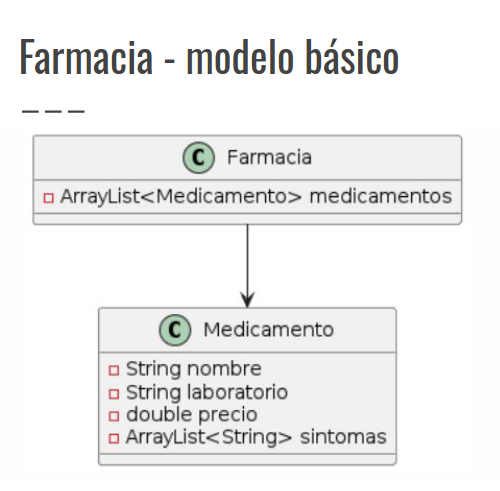
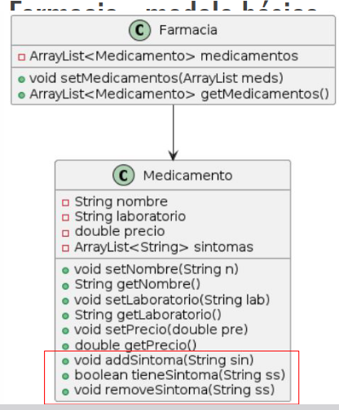
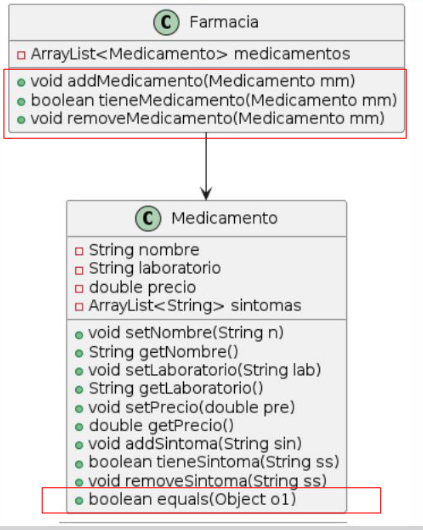
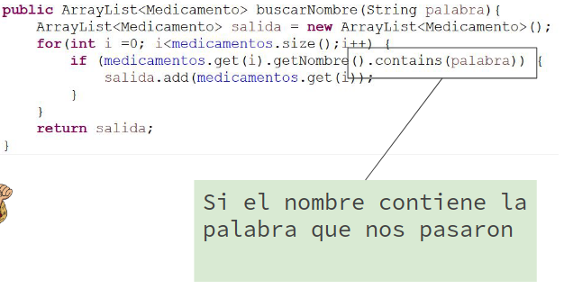
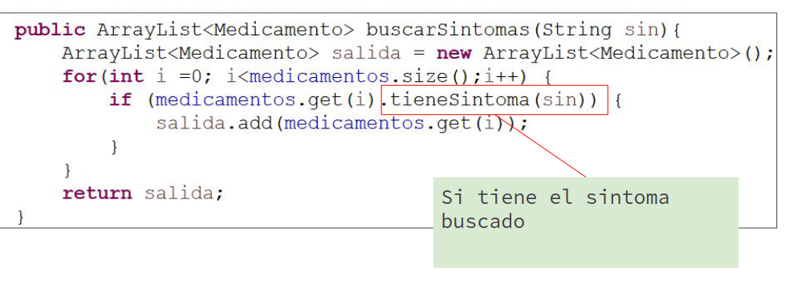
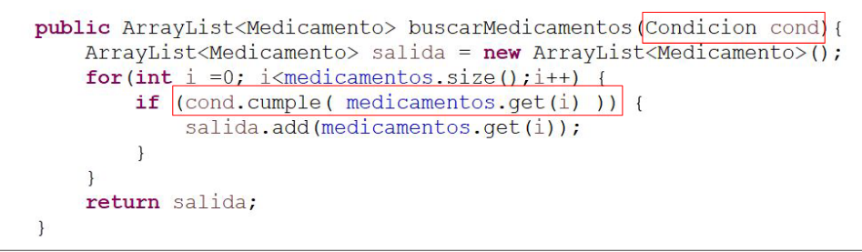
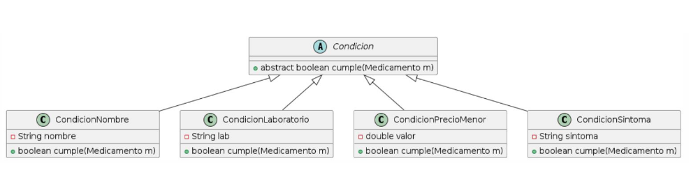
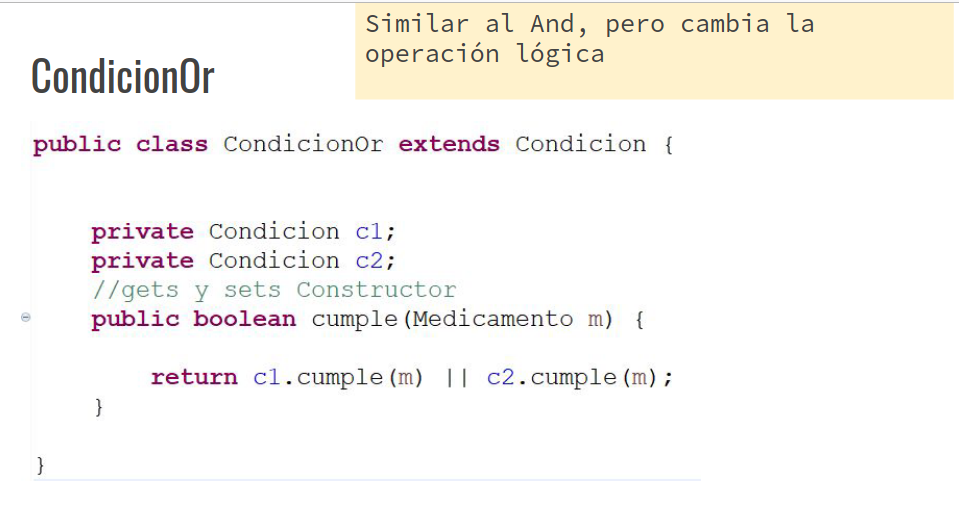
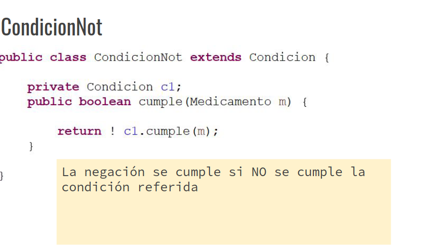
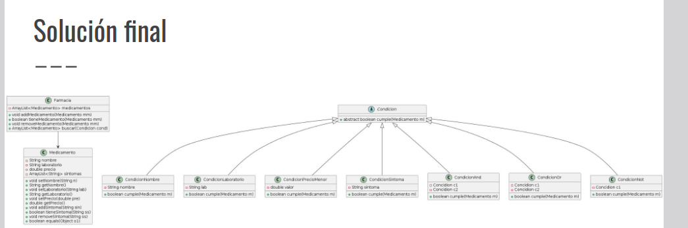

## farmacia - adicional 2
Una <u>**farmacia**</u> desea *organizar sus <u>**medicamentos**</u>*. De cada uno de ellos guarda: el nombre, laboratorio, precio, conjunto de sintomas que trata.

También, desea poder:
- Buscar todos los madicamentos del laboratorio "Bayer".
- Buscar los de "Raffo".
- Buscar todos los medicamentos que contengan la palabra "ina".
- Buscar todos los medicamentos de precio menor a 1500.
- Buscar todos los medicamentos que traten "congestion nasal".

Los anteriores son *sólo algunos ejemplos* de las busquedas que se desea proveer en la farmacia. Es posible que surjan nuevos tipos de busquedas, así como combinaciones lógicas de los anteriores, por ejemplo buscar todos los medicamentos del laboratorio "Bayer" y que el nombre contenga la palabra "ina", o todos los medicamentos que traten "Congestion" y cuesten menos de 400 pesos.

### Farmacia - Modelo básico



Debemos agregar los `getter` y `setters` cuidando de no rompoer el encapsulamiento con los arrayList. Nos surge un posible error de delegacion de responsabilidades.

Por lo que procedemos a implementar el `agregar`, `contiente` y `remover` en vez del problematico getter y setter de los arreglos. 

>En este caso debemos tener cuidado ya que estos nuevos métodos requieren que el objeto que pasamos como parametro implementen el `.equals()`. En este caso al ser un *String* ya está implementado.

- Esto nos permite mantener el control.
- Poder controlar repetidos.



Ahora repetimos el mismo proceso para `medicamentos` en la farmacia.

Como trabajamos con el objeto `medicamentos` debemos implementar el `equals`.

> Este equals se debe implementar en la clase Medicamentos



### <u>Farmacia - Servicios</u>

> "Buscar todos los medicamentos del laboratorio Bayer"

Funcionalidad en la clase Farmacia, busca medicamentos:

```java
    public ArrayList<Medicamento> buscarBayer(){
    ArrayList<Medicamento> salida = new ArrayList<Medicamento>();
    for(int i = 0; i < medicamentos.size(); i++){
        if(medicamentos.get(i).getLaboratorio.equals("Bayer")){
            salida.add(medicamentos.get(i));;
        }
    }
        return salida;
    }
```

Si bien este código funciona, no es orientado a objetos.

Por ejemplo, ya nos podemos encontrar con la constante en código "***Bayer***", Esto quiere decír que tendriamos que escribir exactamento el mismo código pero con otra constante para realizar la busqueda de medicamentos de "***Raffo***".

### Famacia - busqueda por laboratorio:

```java
public ArrayList<Medicamento> buscarLaboratorio(String nombreLaboratorio){
    ArrayList<Mediamento> salida = new ArrayList<Medicamento>();
    for(int i = 0; i<medicamentos.size();i++){
        if(medicamentos.get(i).getLaboratorio.equals(nombreLaboratorio)){
            salida.add(medicamentos.get(i));
        }
    }

}
```


### Busqueda por nombre

Como ya vimos en el caso anterior, ahora vamos a recibir un parametro que contenga la palabra que estamos buscando:



### Busqueda por precio:

> Buscar todos los medicamentos menos a un precio:

```java
    public ArrayList<Medicamento> buscarPrecio(double valor){
        ArrayList<Medicamento> salida = new ArrayList<Medicamento>();

        for(int i = 0; i<medicamentos.size();i++){
            if(medicamentos.get(i).getPrecio < valor){
                salida.add(medicamentos.get(i));
            }
        }
        return salida;
    }

```

### Medicametos que tratan síntomas especificados

> Buscar medicamentos que traten por ejemplo "Congestión nasal"



## Busquedas:

Claramente, esta forma de resolver esta "mal", ya que implica crear un nuevo método por cada parametro de busqueda que se me ocurra:


### ¿qué tienen en común los métodos?

La estructura es la misma en todos los métodos. Cambia la pregunta que le hago al medicamento (el if). **Que condición debe cumplir para que lo agregue o no al resultado**.

#### Encapsular la condición:
- Encapsular el compoirtamiento de preguntarle a un Medicamento si debe o no estar en el resultado.
- Creo el concepto de la condición -> Una clase que se encargue de la pregunta.
- El usuario pasa la consulta que desea realizar como parámetro.
- Se pueden crear hijos de la condición con los tipos de preguntas que puedo realizar.

#### Condición:

Delego la consulta de si un medicamento la cumple o no



> Creamos una clase abstracta "Condicion" con el método abstracto `cumple(Medicamento m)`.

#### Farmacia - condiciones:

Una condición por cada **TIPO** de preguntas que deseo realizar:



#### Condición nombre:
Encapsula la pregunta por nombre, tiene el nombre buscado de atributo

```java
    public class CondicionNombre extends Condicion{
        String nombre;
        //get y set constructor
        public boolean cumple(Medicamento m){
            return.getNombre.equals(nombre);
        }
    }
```
#### Condicion precioMenor:

```java
    public class CondicionPrecioMenor extends Condicion{

        double valor;
        //get set y construct

        public boolean cumple(Medicamento m){
            return m.getPrecio() < valor;
        }

    }
```

#### Condicion Sintoma

```java
public class CondicionSintoma extends Condicion{
    String sintoma;


    public boolean cumple(Medicamento m ){
        return m.tieneSintoma(sintoma);
    }
}
```

## Combinaciones lógicas

Las condiciones, como la que se pone de ejemplo:
> "Que sea de Bayer y contenga la palabra ina"

Ya las hicimos peros separas, una condicion lógica son dos condiciones unidas por un operador lógico (en este caso `and`). Lo mismo en el segundo ejemplo.


### Farmacia - condicion and

- AND es una condición lógica que se forma como la operación lógica `and` de dos condiciones.
- Hereda de `Condicion`.
- Tiene dos condiciones.

### Condicion and

```java
public class CondicionAnd extends Condicion{
    private Condicion c1;
    private Condicion c2;


    //gets set contuctor

    public boolean cumple (Medicamento m){
        return c1.cumple(m) && c2.cumple(m);
    }
}
```

> c1 y c2 pueden ser de caulquier tipo de las anteriores (incluso otros OR, NOT, etc pero solo aporta confusion pensarlo así)

### Condion OR



### Condicion NOT




## Farmacia - instanciacion de las condiciones:

La instanciación de las condiciones se realiza fuera de las clases que representan el modelo. Las hace el usuario cuando quiere hacer una busqueda. 

```java
// Para buscar todos los medicamentos que contengan la prabra ina:
Condicion cond1 = new CondicionNombre("ina");


//medicamentos del  laboratorio "Bayer"
Condicion cond2 = new CondicionLaboratorio("Bayer");
// Para buscar todos los medicamentos que contengan “ina” y sean del lab “Bayer”
Condicion cond3 = new CondicionAnd(cond1, cond2);
// Para buscar todos los medicamentos que contengan “ina” O sean del lab “Bayer”
Condicion cond4 = new CondicionOr(cond1, cond2);
// Para buscar todos los medicamentos que NO (contengan “ina” y sean del lab “Bayer”)
Condicion cond5 = new CondicionNot(cond3);

```

## Solución final:



