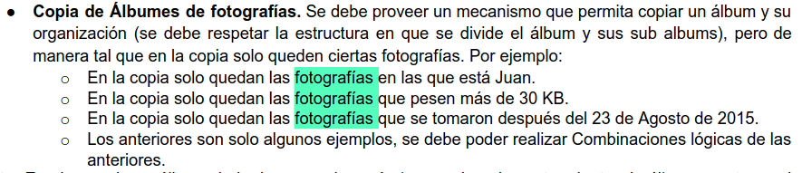

Voy a empezar trabajando con el ejercicio adicional:

Arranca pidiendonos un sistema de administracion de fotografias

> En ningún momento se menciona un aministrador o algo así, se  supone que así nos damos cuenta que es sólo el composite. Igualmente nos dijeron que el parcial va a ser muy parecido a este ejericicio.

Permite organizar `albunes`[*titulo*, *fecha_creacion*] y  `fotografias` [*id*, *titulo*, *peso*, *lista de personas*, *fecha_captura*].

> Rápidamente nos podemos dar cuenta que la lista de personas son solo strings.
> También hicieron mucho foco en no perder el tiempo en detalles no tan necesarios, como por ejemplos si incluir la fecha en el constructor de foto, en sí no es lo que se está evaluando

Un albun consiste en un **subconjunto ordenado** de elementos. Dentro de el, los elementos se ordenan **siempre** por fecha y luego por peso. 

> saber que el orden no va a cambiar a futuro, nos dá el pié para saber que estamos ante un ejemplo `Comparable`



> Podemos notar como los filtros van a ser sólo de fotografias.

## ElementoFoto

```java

/* VERSION RESUMIDA */
public abstract class ElementoFoto implements Comparable<ElementoFoto>{
    
    //lleva un contructor y más cosas
    public abstract double getPeso();
    public abstract int contarFotos();
    public abstract ArrayList<String> getPersonas();
    public abstract ElementoFoto copia(Condicion cond);

    @Override
    public int compareTo(ElementoFoto o) {
        int resul = this.getFecha().compareTo(o.getFecha());
        if (resul == 0)
            return Double.compare(this.getPeso(), o.getPeso());
        return resul;
    }

    protected abstract HashSet<String> getPersonasConConjunto();
}

```

Podemos ver que este elemento implementa la clase `Comparable`, por lo que debe implementar el método `compareTo(ElementoFoto o)`.

También definimos los métodos que se corresponden a los requerimientos del sistema:

1. `getPeso()`: Este se usa para comparar elementos más que nada.
2. `contarFotos`: Contamos la cantidad de **fotos** de los albunes y sub-albunes.
3. `getPersonas()`: Obtenemos una lista de personas sin repetir en todas las fotos del albun y sub albunes.
4. copia(): Nos piden una **copia restringida** de el albun

> Una copia restringida es como un ejercicio de mantener la estructura, sólo que en este caso achicamos dicha estructura.

## Fotografia

Tenemos distintos métodos que nos son útiles para cumplir con los requerimientos
### añadir persona
```java
public void addPersona(String persona){
        if (!personas.contains(persona))
            this.personas.add(persona);
}
```

> Si bien no lo pide, ni tampoco nos sirve para el otro método, por ahi si lo hace un poco más "completa" a la solucion
### getPeso
```java
@Override
public double getPeso() {
    return peso;
}
@Override
public int contarFotos() {
    return 1;
}
``` 

> Estos son los métodos que debemos sobreescribir del elementofoto, que necesitamos para poder implementarlo tambien en el albun.
### obtener la lista de personas
```java
public ArrayList<String> getPersonas() {
    return new ArrayList<>(personas);
}

```

> así no violamos la integridad ni seguridad de nuestro arreglo
### copia restringida
```java
@Override
public ElementoFoto copia(Condicion cond) {
    if (cond.cumple(this)) {
        Fotografia copia = new Fotografia(this.getTitulo(), this.id, this.peso);
        for (String persona : personas)
            copia.addPersona(persona);
        return copia;
    }
    return null;
}
```

> Para realizar la copia de este elemento, primero debemos asegurarnos que cumple con la condicion. Esto es una diferencia a copiar la estructura así nomás, en ese caso copiarimos de una, pero no creo que nos pidas eso seguido. O bien se puede dar el caso de devolver this.

Para realizar la copia creamos una nueva foto, pasandole nuestros parametros como suyos, pero como no podemos copiar al arreglo así nomás, tenemos que añadirle cada persona que está en nuestr lista.

### obtener conjunto de personas que aparecen en la foto
```java
@Override
    protected HashSet<String> getPersonasConConjunto() {
        return new HashSet<>(personas);
}
```
Este metodo se hace para copiar toda la estructura sin repetidos, se puede hacer tranquilamente con un for. Pero en este nivel, es decir en fotografia, se usa porque es albun quien usa y espera un hashset.

Como podemos notar ya aparece un método bastante similar al principio

### aparace una persona
```java
public boolean apareceFulanito(String personaBuscada) {
        return this.personas.contains(personaBuscada);
}
```

Esto método es auxiliar para realizar filtros.

## Albun

El albun solo tiene un tres atributos, pero dos estan en la clase que extiende, solo la lista de elementos es propio. 

### getPeso
```java
    public int contarFotos() {
            int suma = 0;
            for (ElementoFoto e:elementos)
                suma+=e.contarFotos();
            return suma;
    }
```

> por cada elemento, vamos a pedirle la suma de sus fotos, si `e` es una foto, devuelve uno, si es un albun, llama recursivamente a esta funcion, y si tiene 2 fotos, en `suma` retorna 2. Osea ese `e` retorna 2, por lo que se suma a esta variable `suma` "original".


### getPersonas

```java
    public ArrayList<String> getPersonas() {
        ArrayList<String> todasLasPersonas = new ArrayList<>();
        for (ElementoFoto e:elementos) {
            ArrayList<String> resultPacial = e.getPersonas();
            for (String persona:resultPacial)
                if (!todasLasPersonas.contains(persona))
                    todasLasPersonas.add(persona);
        }
        return todasLasPersonas;
    }
```

> Acá solamente estamos agregando personas sin repetidos

### copia restringida

esta es la parte más importante, es una copia restringida **de la estructura**

```java
    public ElementoFoto copia(Condicion cond) {
        Album copia = crearAlbum();
        boolean agrego = false;
        for (ElementoFoto elem:elementos){
            ElementoFoto copiaHijo = elem.copia(cond);
            if (copiaHijo != null){
                copia.addElemento(copiaHijo);
                agrego = true;
            }
        }
        if (agrego) //if (copia.contarFotos()>0)
            return copia;
        else
            return null;
    }
```

> Ahora estuve practicando un poco, el `boolean agrego` lo usamos más que nada para ir chequeando si vamos agregando o no elementos. Por ejemplo, si me fijo en otro albun y este no agrega nada no va a modificar el agrego, entonces no retrona una copia de si mismo, sinó que retorna null. Se usa más que nada en el *elemento compuesto*, también podriamos usar como dice ahí el contarFotos, es decir si agregó alguna foto. Por que pensemos que la condicion evalua fotos, pero igualmente este metodo devuelve cualquier tipo de Elemento, si ninguna foto de un albun pasa la condicion entonces no tiene sentido que retornemos una copia vacía de albun. Por eso de este lado preguntamos si agrego es true, si el albun tiene una foto, o uno de sus hijos.
>
> Osea, de este lado recorremos buscando fotos, si el albun tiene aunque sea una foto que cumpla retornamos una copia de este albun, sinó retornamos null.
>

    [Albun: elementos[ foto:cumple, foto:nocumple  subalbun:[ foto:cumple: foto:cumple] ]]

    Algo así se tendira que ver nuestra copia de elementos

    Entro a albun y recorro sus elementos, agarro solo los elementos que cumplen, si uno de esos elementos es otro albun, repito el proceso.

    > Acá creo que se puede dar el caso de que un albun retorne un albun con sus elementos que cumplen un sólo albun con fotos.


## Diferencias entre Comparator y Comparable

Además de la clase, usamos Comparable en la clase cuando sabemos qe la forma de comparar no va a cambiar y Comparator cuando si lo va a hacer.

> Para comparator según los ejmplos que estuve viendo no extiende una clase comparador, sinó que hacemos el comparadorNombre por ejemplo y que ella implemente directamente a la clase Comparator, hacemos esto con cada una de las clases.


|retorna|condicion|comparacion|
|:-----:|:-------:|:---------:|
| `< 0` |***si*** | p1 < p2   |
| `= 0` |***si*** | p1 = p2   |
| `> 0` |***si*** | p1 > p2   |


| `Comparable`               |         `Comparator`     |
|:--------------------------:|:------------------------:|
|Se utiliza para ordenar objetos con su orden "natural"| Se usa para ordenar objetos de acuerdo a los valores  de diferentes atributos|
|Utiliza el método `compareTO(Object otroObjeto)` | Utiliza el método `compare(Object o1, Object o2)` |
|Compara `this` con respecto a otro objeto | Compara dos objetos recibidos por parametros|
| Está en el paquete *java.lang*, junto a la clase `Object` | Está en el paquete *java.util*|
| Debe ser ***implementado por la clase original***, aquella que quiero que sus instancias se puedan comparar (por ejemplo Persona, Computadora, Proceso) | ***No afecta a la clase original***. Se implementan ***clases independientes*** de la misma|